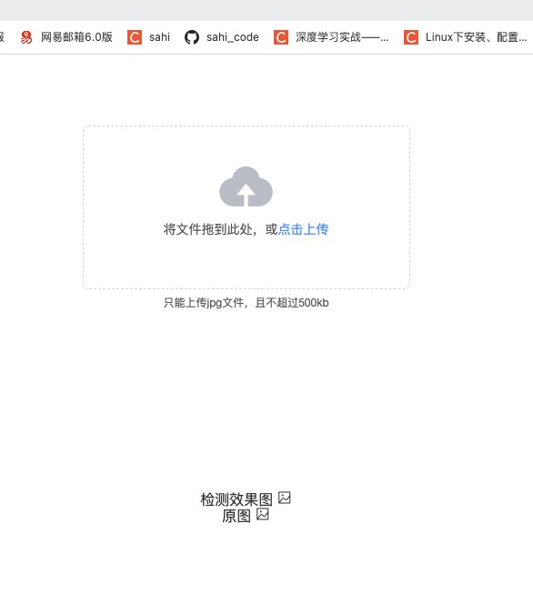

# vue-club

> A Vue.js project

## Build Setup

``` bash
# install dependencies
npm install

# serve with hot reload at localhost:8080
npm run dev

# build for production with minification
npm run build

# build for production and view the bundle analyzer report
npm run build --report

# run unit tests
npm run unit

# run e2e tests
npm run e2e

# run all tests
npm test
```

For a detailed explanation on how things work, check out the [guide](http://vuejs-templates.github.io/webpack/) and [docs for vue-loader](http://vuejs.github.io/vue-loader).

## 项目介绍
感谢作者 <https://github.com/fengsam6/club> 提供的脚手架，基于这个脚手架可以非常快的进行开发和部署。
简单设置一个上传图片调用后端接口的页面，显示检测效果的一个网页，如图效果。
此外项目使用Element-ui组件。


## 项目部署
首先使用下面指令生成dist文件夹，dist文件下有index.html、static。随后推荐使用docker部署，
docker下载镜像nginx，使用下面指令创建容器，将dist文件夹放在/root/nginx，再次重新启动nginx容器即可。
如何指定端口运行，需要指定 -p 端口映射即可。

```bash
npm run build

docker run -d -p 80:80 --name nginx_pest_detecion -v /root/nginx/dist:/usr/share/nginx/html --restart=always nginx

```

## 解决打包后请求地址不对的问题
1:在config文件夹下的index.js及性能修改:
```js
dev: {
    // Paths
    assetsSubDirectory: 'static',
    assetsPublicPath: './',
    proxyTable: {
    '/api': {
        target: 'http://127.0.0.1:8000',
        ws: true, // 代理websockets，配置这个参数
        changeOrigin: true,  // 是否跨域
        pathRewrite: {
        '^api':'http://127.0.0.1:8888'	//填写需要跨域的地址,与上面一致
      }
    }
  }
}
```
2:配置dev开发环境地址，config下的dev.env.js
```js
'use strict'
const merge = require('webpack-merge')
const prodEnv = require('./prod.env')

module.exports = merge(prodEnv, {
  NODE_ENV: '"development"',
  API_HOST:'"/api"'   //配置代理路径的符号
})

```

3:配置生产环境地址.config文件夹下的pro.env.js，如果接口地址没有这个/api路径，就不要添加！
```js
'use strict'
module.exports = {
  NODE_ENV: '"production"',
  API_HOST: '"http://127.0.0.1:8888/api"'     //生产环境的地址
  // API_HOST: '"http://127.0.0.1:8888"'     //生产环境的地址
}
```
4:在组件中修改url地址 ，这样打包后也能正确请求接口地址了。
```js
this.$axios.post(process.env.API_HOST + '/detect', formdata).then(res => {
  if (res.status == 200) {
    data = res.data
    this.det_img = this.pic_static_url + data.det_img_path
    this.det_json = data.result
    this.det_origin_img = this.pic_static_url + data.det_origin_img
    // console.log(data)
    // console.log(this.det_img)
    // console.log(this.det_origin_img)
  }
})
```


